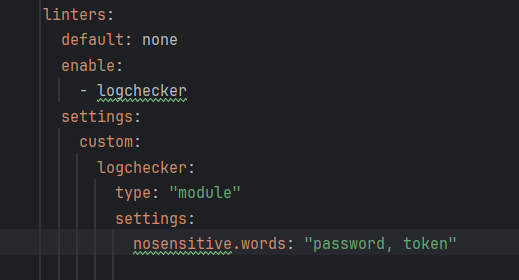
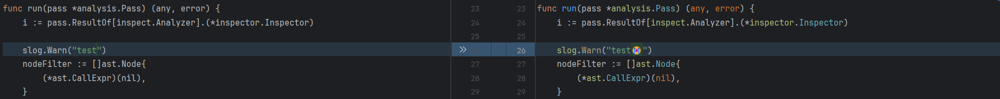
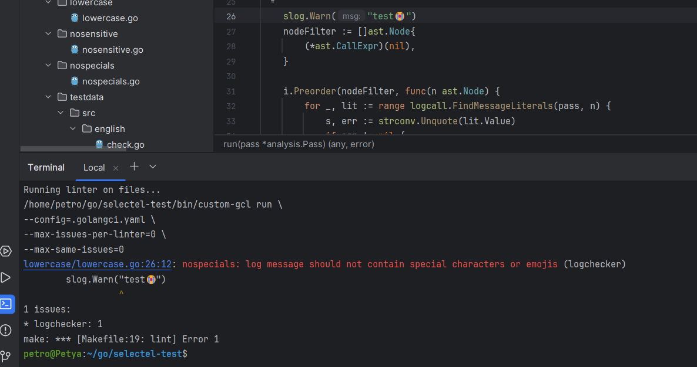
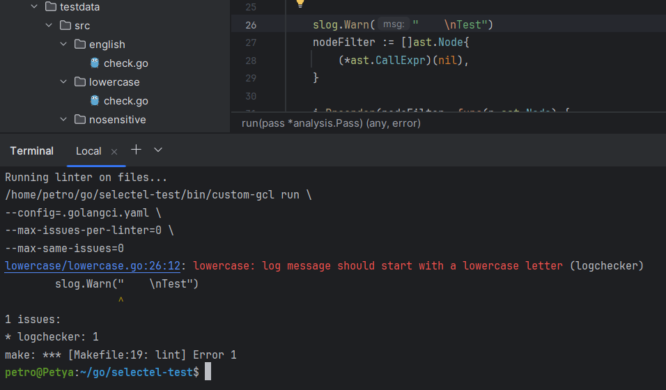

# Log linter

### Сборка приложения
`make build`

### Запуск линтера
`make lint`

### Настройки линтера
Приложение поддерживает настройку чувствительных данных через конфиг .golangci.yaml

### Применение рекомендованных исправлений
`make fix`

### Примеры работы

